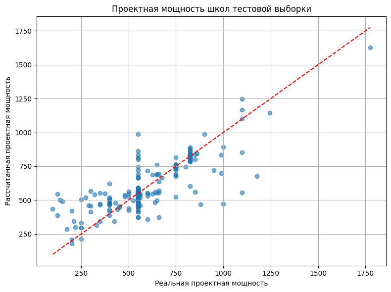
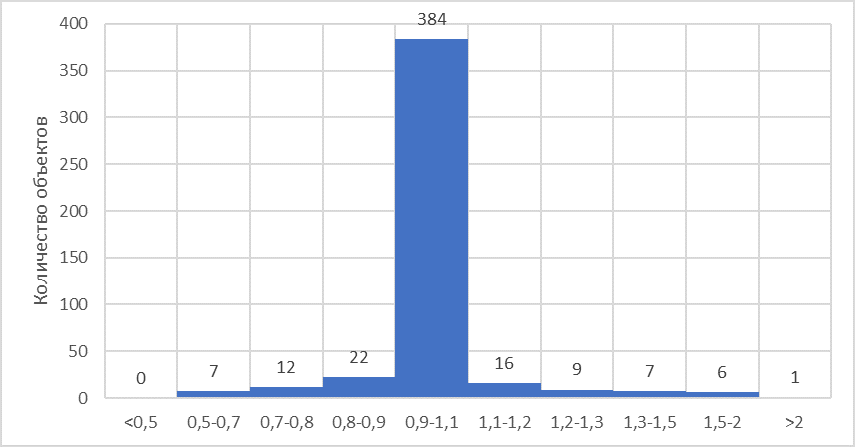

# Разработка метода моделирования проектной мощности объектов социальной инфраструктуры на основе пространственно-морфологического анализа геоданых с применением машинного обучения

## Описание
Данный репозиторий создан в рамках ВКР **"Разработка метода моделирования проектной мощности объектов социальной инфраструктуры на основе пространственно-морфологического анализа геоданых с применением машинного обучения"** по направлению подготовки 07.04.04 Градостроительство. В нем представлены ключевые реализации методов пространственного анализа данных, необходимых для оценки гипотез по преобразованию территорий. 
Для исследования и валидации метода была использованы датасеты школ Санкт-Петербурга и Москвы с их проектной мощностью. 

**Целью** данного исследования является разработке метода позволяющего восполнять данные о проектной мощности объектов социальной инфраструктуры. 
Для достижения этой цели необходимо выполнение следующих задач.

**Задачи**:
- поиск, последующий анализ и классификация существующих методов и моделей позволяющих восполнять данные об объектах;
- разработать собственный метод с использованием наиболее подходящих для этого моделей;
- описать метод и его механизм работы;
- выгрузить и подготовить данные для проведения апробации метода;
- сформулировать и обосновать перечень необходимых и возможных сценариев;
- проверить разработанный метод на сценарных и реальных данных;
- внедрить разработанный метод:
 
## Основные библиотеки
- **pandas**: обработка и анализ табличных данных.
- **osmnx**: работа с графами дорожной сети, включая получение данных с OpenStreetMap.
- **geopandas**: обработка геопространственных данных.
- **matplotlib**: визуализация данных.
- **scikit-learn**: используется для подготовки и оценки моделей машинного обучения: разбиение данных на обучающую и тестовую выборки (train_test_split), кросс-валидация (cross_val_score), метрика RMSE (mean_squared_error), а также сами алгоритмы ансамблевой регрессии — RandomForestRegressor, GradientBoostingRegressor и объединение моделей через VotingRegressor.
- **catboost**: здесь применяется CatBoostRegressor для градиентного бустинга, особенно эффективно обрабатывающего категориальные признаки «из коробки». В коде вы настраиваете число итераций, скорость обучения и глубину деревьев, а затем обучаете модель на ваших геометрических фичах.
- **optuna**: фреймворк для автоматической оптимизации гиперпараметров. В функции optimize_xgboost_with_optuna вы создаёте study, определяете поисковое пространство для XGBRegressor (число деревьев, глубину, скорость обучения, параметры регуляризации и т.д.) и запускаете 50 испытаний, после чего строите оптимальный экземпляр модели.
- **numpy**: базовая библиотека для численных операций: вычисление констант (np.pi), векторных расчётов (np.linalg.norm), элементных операций над массивами (расчёт компактности, координат центроидов, соотношений площадей и периметров, расстояний и т.п.).
- **seaborn**: используется в функции plot_feature_importance поверх Matplotlib для удобного и читаемого построения горизонтальных столбчатых графиков важности признаков (sns.barplot).
- **lightgbm**: модель градиентного бустинга LGBMRegressor от Microsoft, настроенная аналогично CatBoost (число итераций, скорость обучения, глубина), для включения в итоговый ансамбль.
- **shap**: инструмент для объяснения предсказаний моделей через Shapley-значения. Вы импортируете shap, чтобы в дальнейшем оценивать вклад каждого признака в предсказания (например, через shap.TreeExplainer и shap.summary_plot).
- **joblib**: применяется для сериализации/десериализации (функция save_model) обученных моделей, а также предоставляет простой интерфейс для параллельных вычислений в задачах, где это необходимо.

## Основные методы

### 1. Загрузка и подготовка данных

- Загрузка исходного файла в формате **.csv** и преобразование в пространственный слой **.geojson** (с полигонами зданий школ Санкт-Петербурга).
- Использование библиотеки **GeoPandas** для обработки пространственных данных как таблицы `pandas.DataFrame` с поддержкой геометрии.
- Формирование **GeoDataFrame** с колонкой `geometry`, содержащей мультиполигоны зданий.
- Установка метрической системы координат для корректного расчёта площади и периметра.

### 2. Очистка и валидация

- Очистка заголовков, удаление лишних символов.
- Проверка наличия ключевых признаков: **area**, **perimeter**, **floors**, **geometry**.
- Приведение типов: числовые — `float`, категориальные — `str`.
- Заполнение `NULL` значениями при отсутствии данных, при необходимости — генерация новых полей со средними значениями (например, этажность).

### 3. Генерация геометрических признаков

- Вычисление признаков с использованием **shapely**, **GeoPandas**, **NumPy**:
  - **area** — площадь здания (м²)
  - **perimeter** — длина внешнего контура
  - **area/perimeter** — коэффициент плотности
  - **коэффициент компактности**
  - **коэффициент выпуклости**
  - **количество вершин полигона**
  - **ширина/длина описывающего прямоугольника**
  - **centroid_x**, **centroid_y** — координаты центроида

### 4. Разделение выборки

- Деление на обучающую и тестовую выборки в пропорции **80/20**.
- Использование `random_state` для воспроизводимости.
- Целевая переменная — **проектная мощность** из РГИС.

### 5. Обучение моделей

- Алгоритмы:
  - **Random Forest**
  - **Gradient Boosting**
  - **XGBoost** (с гиперпараметрами через **Optuna**)
  - **CatBoost**
  - **LightGBM**

- Используемые библиотеки: **scikit-learn**, **xgboost**, **catboost**, **lightgbm**

### 6. Ансамбль моделей

- Формирование ансамбля через **Voting Regressor**:
  - взвешенное усреднение предсказаний всех моделей
  - учёт точности моделей при взвешивании

- Преимущества ансамбля:
  - устойчивость (**Random Forest**)
  - точность (**XGBoost**, **Gradient Boosting**)
  - скорость (**LightGBM**)
  - работа с категориальными данными (**CatBoost**)

- Сериализация модели с помощью **joblib**.

### 7. Оценка качества

- Основная метрика — **RMSE**:
  **RMSE = sqrt( (1/n) * Σ (yᵢ - ŷᵢ)² )**

  где:
  - `n` — количество наблюдений,
  - `yᵢ` — фактическое значение,
  - `ŷᵢ` — предсказанное значение.

- Чем ниже RMSE, тем выше точность модели.
- Ансамбль показывает лучшие значения ошибки, чем каждая модель по отдельности.
  
**Критерии приемлемости модели:**
- не менее **80%** предсказаний попадают в диапазон **±20%** от истинного значения;
- или не менее **70%** объектов — в пределах **±10%** отклонения.

### 8. Применение модели

- Входные данные: файл **.geojson** с `geometry` и `floors`.
- Повторное извлечение геометрических признаков.
- Прогноз проектной мощности для каждого здания.
- Выход: таблица с результатами, возможна экспорт в **.geojson** и визуализация в ГИС

### Пример рассчитанных данных:
Рис.1 Соотношение рассчитанной и реальной проектных мощностей школ из датасета Москвы

Рис.2 Распределение точности рассчитанной проектной мощности школ на объединённом датасете школ Санкт-Петербурга и Москвы

## Структура репозитория
- **main_code**: основной файл с кодом для обучения модели.
- **additional_code**: дополнительный файл с кодом для расч1та геометрических характеристик полигонов объектов.
- **for_tests**: основной файл с кодом для расчёта проектной мощности на обученной модели.
- **Данные**: входные и выходные данные, включая датасеты школ Москвы и Санкт-Петербурга.
- **Документы**: файлы полученных результатов при работе модели по разным сценариям в виде графиков
- **README**: описание репозитория и методов.

## Использование
1. Установите зависимости из `requirements.txt`.
2. Откройте main_code.py для обучения модели.
3. Следуйте инструкциям в ноутбуке для запуска обучения модели по расчёта проектной мощности на обучающей выборке.
4. Откройте for_tests.py для выполнения расчёта.
3. Следуйте инструкциям в ноутбуке для запуска обученной модели для расчёта проектной мощности на тестовой выборке.

## Авторы
Исследование проведено в рамках ВКР.
- Беляев Александр Владимирович, 410935@edu.itmo.ru
  
## Лицензия
Данный проект распространяется под свободной лицензией. Используйте материалы в образовательных и исследовательских целях.
